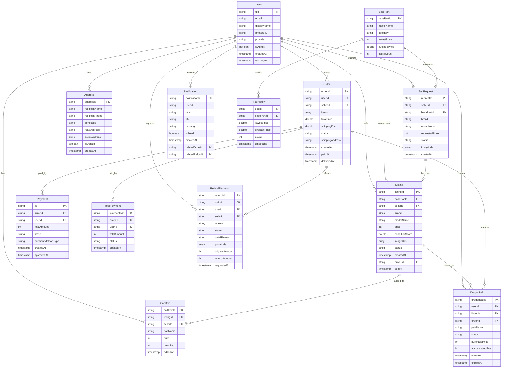
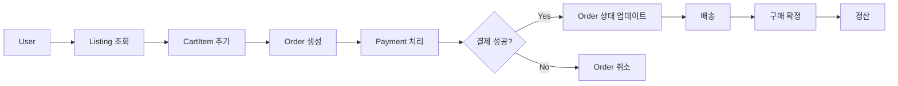
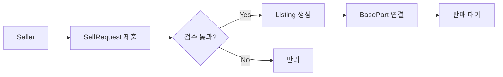
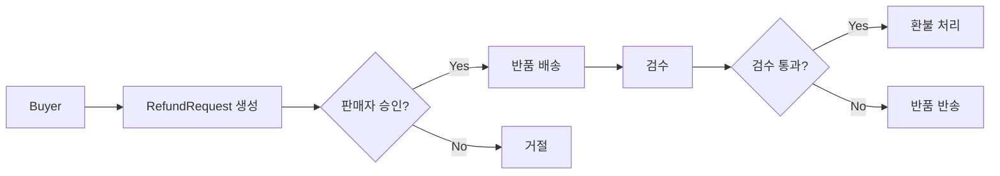
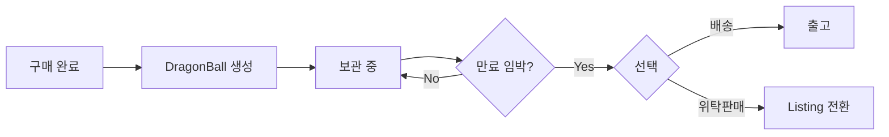

# PiCom ERD (Entity Relationship Diagram)

**생성일**: 2026-01-23
**버전**: 1.0.0
**프로젝트**: PiCom - 중고 PC 부품 거래 플랫폼

---

## 1. ERD 개요

### 핵심 엔티티 (13개)

| 엔티티 | Firestore 컬렉션 | 설명 |
|--------|-----------------|------|
| User | `users/{uid}` | 사용자 (구매자/판매자) |
| Listing | `listings/{id}` | 판매 매물 |
| BasePart | `base_parts/{id}` | 부품 기준 정보 (엑셀에서 생성) |
| CartItem | `users/{uid}/cart/{id}` | 장바구니 항목 |
| Order | `orders/{id}` | 주문 |
| Payment | `payments/{tid}` | 결제 (KakaoPay) |
| TossPayment | `toss_payments/{key}` | 결제 (Toss) |
| Address | `users/{uid}/addresses/{id}` | 배송 주소 |
| RefundRequest | `refundRequests/{id}` | 환불 요청 |
| SellRequest | `sell_requests/{id}` | 판매 요청 |
| DragonBall | `users/{uid}/dragonBalls/{id}` | 드래곤볼 (보관 서비스) |
| Notification | `notifications/{id}` | 알림 |
| PriceHistory | `priceHistory/{id}` | 가격 이력 |

---

## 2. ERD 다이어그램 (Mermaid)



---

## 3. 데이터 흐름 다이어그램

### 3.1 구매 흐름



### 3.2 판매 흐름



### 3.3 환불 흐름



### 3.4 드래곤볼 (보관 서비스) 흐름



---

## 4. 컬렉션 구조

```
firestore/
├── users/                          [사용자]
│   └── {uid}/
│       ├── cart/                   [장바구니]
│       │   └── {cartItemId}
│       ├── addresses/              [배송주소]
│       │   └── {addressId}
│       └── dragonBalls/            [드래곤볼]
│           └── {dragonBallId}
│
├── listings/                       [매물]
│   └── {listingId}
│
├── base_parts/                     [부품 기준 - 엑셀에서 생성]
│   └── {basePartId}
│
├── orders/                         [주문]
│   └── {orderId}
│
├── payments/                       [KakaoPay 결제]
│   └── {tid}
│
├── toss_payments/                  [Toss 결제]
│   └── {paymentKey}
│
├── refundRequests/                 [환불 요청]
│   └── {refundId}
│
├── sell_requests/                  [판매 요청]
│   └── {requestId}
│
├── notifications/                  [알림]
│   └── {notificationId}
│
├── priceHistory/                   [가격 이력]
│   └── {docId}
│
└── dragonBallAgreements/           [드래곤볼 동의]
    └── {agreementId}
```

---

## 5. 핵심 관계 요약

### 5.1 User 중심 관계

| 관계 | 설명 | 타입 |
|------|------|------|
| User → Listing | 판매자가 매물 등록 | 1:N |
| User → Order | 구매자/판매자 주문 | 1:N |
| User → CartItem | 장바구니 (서브컬렉션) | 1:N |
| User → Address | 배송주소 (서브컬렉션) | 1:N |
| User → DragonBall | 보관 부품 (서브컬렉션) | 1:N |
| User → SellRequest | 판매 요청 | 1:N |
| User → RefundRequest | 환불 요청 | 1:N |
| User → Notification | 알림 | 1:N |

### 5.2 BasePart 중심 관계

| 관계 | 설명 | 타입 |
|------|------|------|
| BasePart → Listing | 매물 카테고리화 | 1:N |
| BasePart → PriceHistory | 가격 추적 | 1:N |
| BasePart → SellRequest | 판매 요청 참조 | 1:N |

### 5.3 Order 중심 관계

| 관계 | 설명 | 타입 |
|------|------|------|
| Order → Payment | 결제 정보 | 1:N |
| Order → RefundRequest | 환불 요청 | 1:N |
| Order → DragonBall | 보관 서비스 | 1:N |

---

## 6. 인덱스 현황

### 6.1 복합 인덱스 (firestore.indexes.json)

| 컬렉션 | 필드 | 용도 |
|--------|------|------|
| `listings` | status, price | 가격순 조회 |
| `listings` | basePartId, status, createdAt | 부품별 최신 매물 |
| `listings` | sellerId, status, soldAt | 판매자 판매 이력 |
| `orders` | userId, createdAt | 구매 이력 |
| `refundRequests` | status, requestedAt | 환불 처리 대기열 |
| `refundRequests` | userId, createdAt | 구매자 환불 이력 |
| `sell_requests` | status, createdAt | 판매 요청 처리 |
| `notifications` | userId, createdAt | 사용자 알림 조회 |
| `dragonBalls` | status, expiresAt | 만료 임박 조회 (CollectionGroup) |
| `priceHistory` | basePartId, timestamp | 가격 추이 조회 |

---

## 7. Enum 타입 정리

### 7.1 Listing Status

```dart
enum ListingStatus {
  available,   // 판매 중
  sold,        // 판매 완료
  cancelled,   // 취소됨
  pending,     // 대기 중
}
```

### 7.2 Order Status

```dart
enum OrderStatus {
  pending,           // 결제 대기
  paid,              // 결제 완료
  shipped,           // 배송 중
  delivered,         // 배송 완료
  confirmed,         // 구매 확정
  refundRequested,   // 환불 요청
  refundCompleted,   // 환불 완료
}
```

### 7.3 RefundRequest Status

```dart
enum RefundStatus {
  pending,              // 요청 대기
  approved,             // 승인됨
  rejected,             // 거절됨
  itemShipped,          // 반품 배송
  itemReceived,         // 반품 수령
  inspectionInProgress, // 검수 중
  inspectionPass,       // 검수 통과
  inspectionFail,       // 검수 실패
  refundProcessing,     // 환불 처리 중
  refundCompleted,      // 환불 완료
  cancelled,            // 취소됨
}
```

### 7.4 SellRequest Status

```dart
enum SellRequestStatus {
  pending,    // 검수 대기
  testing,    // 검수 중
  approved,   // 승인됨
  rejected,   // 반려됨
  sold,       // 판매 완료
  cancelled,  // 취소됨
}
```

### 7.5 DragonBall Status

```dart
enum DragonBallStatus {
  stored,       // 보관 중
  packing,      // 포장 중
  shipping,     // 배송 중
  delivered,    // 배송 완료
  consignment,  // 위탁 판매 중
  sold,         // 판매 완료
}
```

### 7.6 Part Category

```dart
enum PartCategory {
  cpu,        // CPU
  gpu,        // 그래픽카드
  ssd,        // SSD
  mainboard,  // 메인보드
  ram,        // 램
  psu,        // 파워서플라이
  cooler,     // 쿨러
  pccase,     // 케이스
}
```

---

## 8. 피쳐별 엔티티 매핑

| Feature | Primary Entity | Related Entities |
|---------|----------------|------------------|
| **auth** | User | - |
| **listing** | Listing, BasePart | User |
| **cart** | CartItem | User, Listing |
| **checkout** | Order | CartItem, Payment, Address |
| **payment** | Payment, TossPayment | Order, User |
| **order** | Order | User, Listing |
| **refund** | RefundRequest | Order, User, Notification |
| **address** | Address | User |
| **dragon_ball** | DragonBall | User, Order, Listing |
| **sell_request** | SellRequest | User, BasePart |
| **my_page** | User, Order | Address, Notification |
| **recommendation** | BasePart | - |
| **home** | Listing, BasePart | - |
| **notification** | Notification | User, Order, RefundRequest |

---

## 9. 데이터 제약 조건

### 9.1 필수 외래키

| 엔티티 | 외래키 | 참조 | 필수 |
|--------|--------|------|------|
| Listing | basePartId | BasePart | ✅ |
| Listing | sellerId | User | ✅ |
| Order | userId | User | ✅ |
| Order | sellerId | User | ✅ |
| CartItem | listingId | Listing | ✅ |
| CartItem | sellerId | User | ✅ |
| RefundRequest | orderId | Order | ✅ |
| RefundRequest | userId | User | ✅ |
| SellRequest | sellerId | User | ✅ |
| SellRequest | basePartId | BasePart | ✅ |
| DragonBall | userId | User | ✅ |
| DragonBall | orderId | Order | ✅ |
| DragonBall | listingId | Listing | ✅ |
| Payment | orderId | Order | ✅ |
| Notification | userId | User | ✅ |

### 9.2 삭제 영향도

```
User 삭제 시:
├── Listing (sellerId) - 연관 매물 처리 필요
├── Order (userId, sellerId) - 기록 보존 필요
├── CartItem - 삭제 가능
├── Address - 삭제 가능
├── DragonBall - 보관 부품 처리 필요
├── SellRequest - 기록 보존
├── RefundRequest - 기록 보존
└── Notification - 삭제 가능

Order 삭제 시:
├── Payment - 기록 보존 필요
├── RefundRequest - 연관 처리 필요
└── DragonBall - 보관 부품 처리 필요

Listing 삭제 시:
├── CartItem - 삭제 필요
└── DragonBall - 참조 처리 필요
```

---

## 10. 다음 단계 권장 사항

### 10.1 데이터 모델 개선 (Phase 1)

1. **결제 통합**: Payment와 TossPayment를 단일 인터페이스로 통합
2. **주문 상태 기계**: OrderStatus를 명확한 상태 기계로 정의
3. **가격 일관성**: 모든 가격 필드를 int (원 단위)로 통일

### 10.2 인덱스 최적화

1. **CollectionGroup 인덱스**: dragonBalls 외에 cart도 검토
2. **복합 쿼리 최적화**: 자주 사용되는 필터 조합 분석

### 10.3 보안 규칙 검토

1. **필드 레벨 보안**: 민감 정보 (결제, 주소) 접근 제한
2. **문서 레벨 보안**: 소유자/판매자만 수정 가능

---

*Generated by MoAI-ADK ERD Analysis*
*Last Updated: 2026-01-23*
